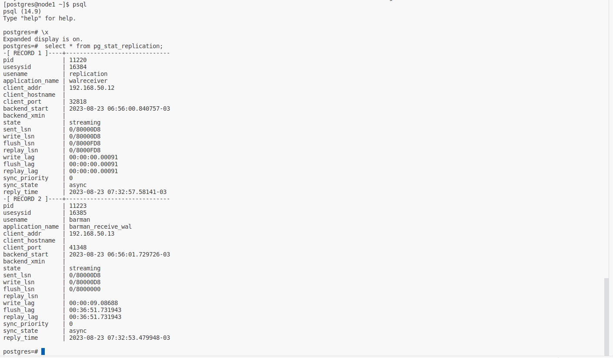
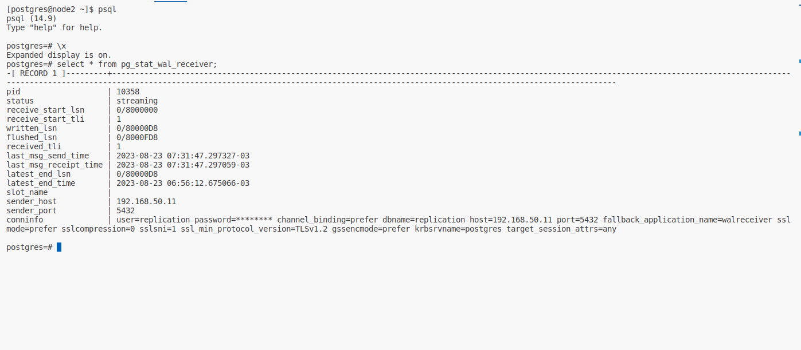
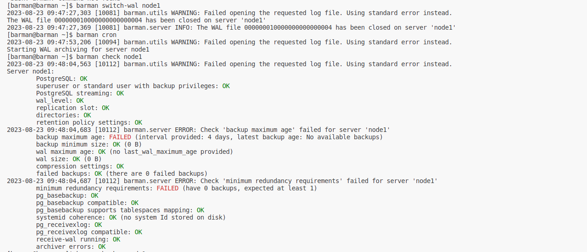
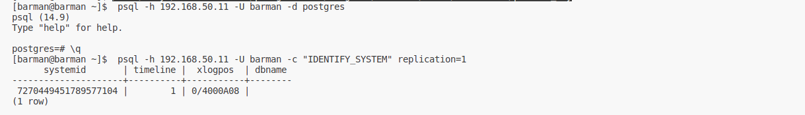
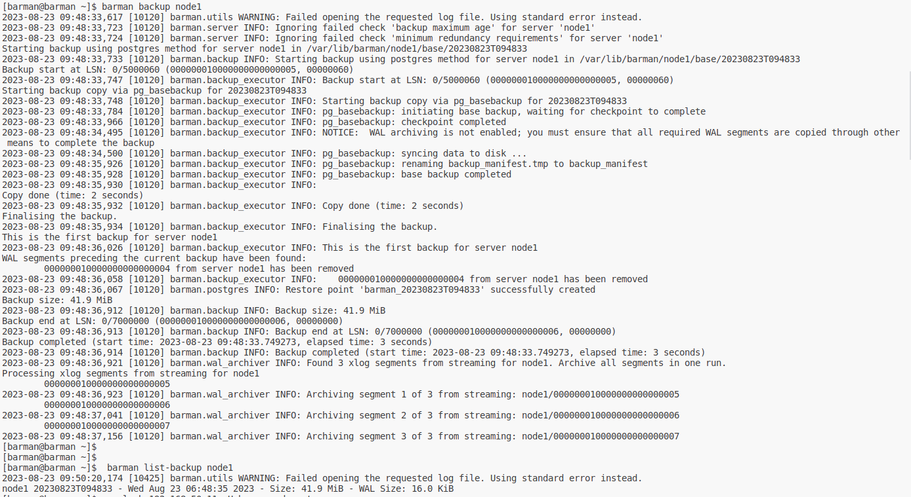
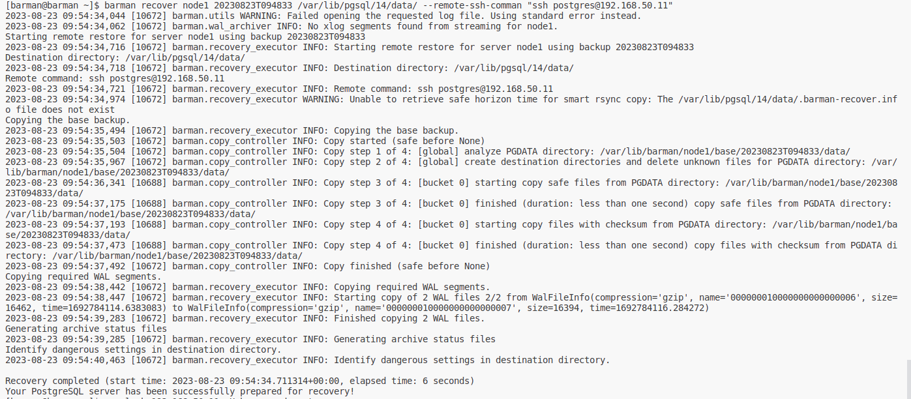

# PostgreSQL
Для выполнения этого действия требуется установить приложением git:
`git clone https://github.com/altyn-kenzhebaev/postgres-hw28.git`
В текущей директории появится папка с именем репозитория. В данном случае postgres-hw28. Ознакомимся с содержимым:
```
cd postgres-hw28
ls -l
ansible
screens
README.md
Vagrantfile
```
Здесь:
- ansible - папка с плэйбуком
- screens - папка со скриншотами для рукуводства
- README.md - файл с данным руководством
- Vagrantfile - файл описывающий виртуальную инфраструктуру для `Vagrant`
Запускаем ВМ:
```
vagrant up
```
## Проверка репликации



## Выполнение резервной копии и восстановления посредством Barman
Логинимся на сервер, проверяем возможность соединения:
```
# vagrant ssh barman
Last login: Wed Aug 23 09:42:56 2023 from 192.168.50.1
[vagrant@barman ~]$ sudo su - postgres
su: user postgres does not exist or the user entry does not contain all the required fields
[vagrant@barman ~]$ sudo -i
[root@barman ~]# 
logout
[vagrant@barman ~]$ sudo su - barman
[barman@barman ~]$  psql -h 192.168.50.11 -U barman -d postgres 
psql (14.9)
Type "help" for help.

postgres=# \q
[barman@barman ~]$  psql -h 192.168.50.11 -U barman -c "IDENTIFY_SYSTEM" replication=1
      systemid       | timeline |  xlogpos  | dbname 
---------------------+----------+-----------+--------
 7270449451789577104 |        1 | 0/4000A08 | 
(1 row)

```
Проверяем функциональность:
```
[barman@barman ~]$ barman switch-wal node1
2023-08-23 09:47:27,303 [10081] barman.utils WARNING: Failed opening the requested log file. Using standard error instead.
The WAL file 000000010000000000000004 has been closed on server 'node1'
2023-08-23 09:47:27,369 [10081] barman.server INFO: The WAL file 000000010000000000000004 has been closed on server 'node1'
[barman@barman ~]$ barman cron
2023-08-23 09:47:53,206 [10094] barman.utils WARNING: Failed opening the requested log file. Using standard error instead.
Starting WAL archiving for server node1
[barman@barman ~]$ barman check node1
2023-08-23 09:48:04,563 [10112] barman.utils WARNING: Failed opening the requested log file. Using standard error instead.
Server node1:
        PostgreSQL: OK
        superuser or standard user with backup privileges: OK
        PostgreSQL streaming: OK
        wal_level: OK
        replication slot: OK
        directories: OK
        retention policy settings: OK
2023-08-23 09:48:04,683 [10112] barman.server ERROR: Check 'backup maximum age' failed for server 'node1'
        backup maximum age: FAILED (interval provided: 4 days, latest backup age: No available backups)
        backup minimum size: OK (0 B)
        wal maximum age: OK (no last_wal_maximum_age provided)
        wal size: OK (0 B)
        compression settings: OK
        failed backups: OK (there are 0 failed backups)
2023-08-23 09:48:04,687 [10112] barman.server ERROR: Check 'minimum redundancy requirements' failed for server 'node1'
        minimum redundancy requirements: FAILED (have 0 backups, expected at least 1)
        pg_basebackup: OK
        pg_basebackup compatible: OK
        pg_basebackup supports tablespaces mapping: OK
        systemid coherence: OK (no system Id stored on disk)
        pg_receivexlog: OK
        pg_receivexlog compatible: OK
        receive-wal running: OK
        archiver errors: OK
```
Выполняем резервную копию и проверяем бэкап:
```
[barman@barman ~]$ barman backup node1
2023-08-23 09:48:33,617 [10120] barman.utils WARNING: Failed opening the requested log file. Using standard error instead.
2023-08-23 09:48:33,723 [10120] barman.server INFO: Ignoring failed check 'backup maximum age' for server 'node1'
2023-08-23 09:48:33,724 [10120] barman.server INFO: Ignoring failed check 'minimum redundancy requirements' for server 'node1'
Starting backup using postgres method for server node1 in /var/lib/barman/node1/base/20230823T094833
2023-08-23 09:48:33,733 [10120] barman.backup INFO: Starting backup using postgres method for server node1 in /var/lib/barman/node1/base/20230823T094833
Backup start at LSN: 0/5000060 (000000010000000000000005, 00000060)
2023-08-23 09:48:33,747 [10120] barman.backup_executor INFO: Backup start at LSN: 0/5000060 (000000010000000000000005, 00000060)
Starting backup copy via pg_basebackup for 20230823T094833
2023-08-23 09:48:33,748 [10120] barman.backup_executor INFO: Starting backup copy via pg_basebackup for 20230823T094833
2023-08-23 09:48:33,784 [10120] barman.backup_executor INFO: pg_basebackup: initiating base backup, waiting for checkpoint to complete
2023-08-23 09:48:33,966 [10120] barman.backup_executor INFO: pg_basebackup: checkpoint completed
2023-08-23 09:48:34,495 [10120] barman.backup_executor INFO: NOTICE:  WAL archiving is not enabled; you must ensure that all required WAL segments are copied through other means to complete the backup
2023-08-23 09:48:34,500 [10120] barman.backup_executor INFO: pg_basebackup: syncing data to disk ...
2023-08-23 09:48:35,926 [10120] barman.backup_executor INFO: pg_basebackup: renaming backup_manifest.tmp to backup_manifest
2023-08-23 09:48:35,928 [10120] barman.backup_executor INFO: pg_basebackup: base backup completed
2023-08-23 09:48:35,930 [10120] barman.backup_executor INFO: 
Copy done (time: 2 seconds)
2023-08-23 09:48:35,932 [10120] barman.backup_executor INFO: Copy done (time: 2 seconds)
Finalising the backup.
2023-08-23 09:48:35,934 [10120] barman.backup_executor INFO: Finalising the backup.
This is the first backup for server node1
2023-08-23 09:48:36,026 [10120] barman.backup_executor INFO: This is the first backup for server node1
WAL segments preceding the current backup have been found:
        000000010000000000000004 from server node1 has been removed
2023-08-23 09:48:36,058 [10120] barman.backup_executor INFO:    000000010000000000000004 from server node1 has been removed
2023-08-23 09:48:36,067 [10120] barman.postgres INFO: Restore point 'barman_20230823T094833' successfully created
Backup size: 41.9 MiB
2023-08-23 09:48:36,912 [10120] barman.backup INFO: Backup size: 41.9 MiB
Backup end at LSN: 0/7000000 (000000010000000000000006, 00000000)
2023-08-23 09:48:36,913 [10120] barman.backup INFO: Backup end at LSN: 0/7000000 (000000010000000000000006, 00000000)
Backup completed (start time: 2023-08-23 09:48:33.749273, elapsed time: 3 seconds)
2023-08-23 09:48:36,914 [10120] barman.backup INFO: Backup completed (start time: 2023-08-23 09:48:33.749273, elapsed time: 3 seconds)
2023-08-23 09:48:36,921 [10120] barman.wal_archiver INFO: Found 3 xlog segments from streaming for node1. Archive all segments in one run.
Processing xlog segments from streaming for node1
        000000010000000000000005
2023-08-23 09:48:36,923 [10120] barman.wal_archiver INFO: Archiving segment 1 of 3 from streaming: node1/000000010000000000000005
        000000010000000000000006
2023-08-23 09:48:37,041 [10120] barman.wal_archiver INFO: Archiving segment 2 of 3 from streaming: node1/000000010000000000000006
        000000010000000000000007
2023-08-23 09:48:37,156 [10120] barman.wal_archiver INFO: Archiving segment 3 of 3 from streaming: node1/000000010000000000000007
[barman@barman ~]$ 
[barman@barman ~]$ 
[barman@barman ~]$  barman list-backup node1
2023-08-23 09:50:20,174 [10425] barman.utils WARNING: Failed opening the requested log file. Using standard error instead.
node1 20230823T094833 - Wed Aug 23 06:48:35 2023 - Size: 41.9 MiB - WAL Size: 16.0 KiB
```
Для проверки удаляем тестовые БД:
```
[barman@barman ~]$  psql -h 192.168.50.11 -U barman -d postgres
psql (14.9)
Type "help" for help.

postgres=# \l
                              List of databases
   Name    |  Owner   | Encoding | Collate |  Ctype  |   Access privileges   
-----------+----------+----------+---------+---------+-----------------------
 otus      | postgres | UTF8     | C.UTF-8 | C.UTF-8 | 
 otus_test | postgres | UTF8     | C.UTF-8 | C.UTF-8 | 
 postgres  | postgres | UTF8     | C.UTF-8 | C.UTF-8 | 
 template0 | postgres | UTF8     | C.UTF-8 | C.UTF-8 | =c/postgres          +
           |          |          |         |         | postgres=CTc/postgres
 template1 | postgres | UTF8     | C.UTF-8 | C.UTF-8 | =c/postgres          +
           |          |          |         |         | postgres=CTc/postgres
(5 rows)

postgres=# drop database otus;
DROP DATABASE
postgres=# drop database otus_test;
DROP DATABASE
postgres=# 
\q
```
Восстанавливаемся с бэкапа:
```
[barman@barman ~]$ barman recover node1 20230823T094833 /var/lib/pgsql/14/data/ --remote-ssh-comman "ssh postgres@192.168.50.11"
2023-08-23 09:54:34,044 [10672] barman.utils WARNING: Failed opening the requested log file. Using standard error instead.
2023-08-23 09:54:34,062 [10672] barman.wal_archiver INFO: No xlog segments found from streaming for node1.
Starting remote restore for server node1 using backup 20230823T094833
2023-08-23 09:54:34,716 [10672] barman.recovery_executor INFO: Starting remote restore for server node1 using backup 20230823T094833
Destination directory: /var/lib/pgsql/14/data/
2023-08-23 09:54:34,718 [10672] barman.recovery_executor INFO: Destination directory: /var/lib/pgsql/14/data/
Remote command: ssh postgres@192.168.50.11
2023-08-23 09:54:34,721 [10672] barman.recovery_executor INFO: Remote command: ssh postgres@192.168.50.11
2023-08-23 09:54:34,974 [10672] barman.recovery_executor WARNING: Unable to retrieve safe horizon time for smart rsync copy: The /var/lib/pgsql/14/data/.barman-recover.info file does not exist
Copying the base backup.
2023-08-23 09:54:35,494 [10672] barman.recovery_executor INFO: Copying the base backup.
2023-08-23 09:54:35,503 [10672] barman.copy_controller INFO: Copy started (safe before None)
2023-08-23 09:54:35,504 [10672] barman.copy_controller INFO: Copy step 1 of 4: [global] analyze PGDATA directory: /var/lib/barman/node1/base/20230823T094833/data/
2023-08-23 09:54:35,967 [10672] barman.copy_controller INFO: Copy step 2 of 4: [global] create destination directories and delete unknown files for PGDATA directory: /var/lib/barman/node1/base/20230823T094833/data/
2023-08-23 09:54:36,341 [10688] barman.copy_controller INFO: Copy step 3 of 4: [bucket 0] starting copy safe files from PGDATA directory: /var/lib/barman/node1/base/20230823T094833/data/
2023-08-23 09:54:37,175 [10688] barman.copy_controller INFO: Copy step 3 of 4: [bucket 0] finished (duration: less than one second) copy safe files from PGDATA directory: /var/lib/barman/node1/base/20230823T094833/data/
2023-08-23 09:54:37,193 [10688] barman.copy_controller INFO: Copy step 4 of 4: [bucket 0] starting copy files with checksum from PGDATA directory: /var/lib/barman/node1/base/20230823T094833/data/
2023-08-23 09:54:37,473 [10688] barman.copy_controller INFO: Copy step 4 of 4: [bucket 0] finished (duration: less than one second) copy files with checksum from PGDATA directory: /var/lib/barman/node1/base/20230823T094833/data/
2023-08-23 09:54:37,492 [10672] barman.copy_controller INFO: Copy finished (safe before None)
Copying required WAL segments.
2023-08-23 09:54:38,442 [10672] barman.recovery_executor INFO: Copying required WAL segments.
2023-08-23 09:54:38,447 [10672] barman.recovery_executor INFO: Starting copy of 2 WAL files 2/2 from WalFileInfo(compression='gzip', name='000000010000000000000006', size=16462, time=1692784114.6383083) to WalFileInfo(compression='gzip', name='000000010000000000000007', size=16394, time=1692784116.284272)
2023-08-23 09:54:39,283 [10672] barman.recovery_executor INFO: Finished copying 2 WAL files.
Generating archive status files
2023-08-23 09:54:39,285 [10672] barman.recovery_executor INFO: Generating archive status files
Identify dangerous settings in destination directory.
2023-08-23 09:54:40,463 [10672] barman.recovery_executor INFO: Identify dangerous settings in destination directory.

Recovery completed (start time: 2023-08-23 09:54:34.711314+00:00, elapsed time: 6 seconds)
Your PostgreSQL server has been successfully prepared for recovery!
```
Логинимся в node1 и перезапускаем службу:
```
[vagrant@node1 ~]$ sudo -i
[root@node1]# systemctl restart postgresql-14
```
Проверяем:
```
[barman@barman ~]$  psql -h 192.168.50.11 -U barman -d postgres
psql (14.9)
Type "help" for help.

postgres=# \l
                              List of databases
   Name    |  Owner   | Encoding | Collate |  Ctype  |   Access privileges   
-----------+----------+----------+---------+---------+-----------------------
 otus      | postgres | UTF8     | C.UTF-8 | C.UTF-8 | 
 otus_test | postgres | UTF8     | C.UTF-8 | C.UTF-8 | 
 postgres  | postgres | UTF8     | C.UTF-8 | C.UTF-8 | 
 template0 | postgres | UTF8     | C.UTF-8 | C.UTF-8 | =c/postgres          +
           |          |          |         |         | postgres=CTc/postgres
 template1 | postgres | UTF8     | C.UTF-8 | C.UTF-8 | =c/postgres          +
           |          |          |         |         | postgres=CTc/postgres
(5 rows)

postgres=# 
```
## Проверка работоспособности



